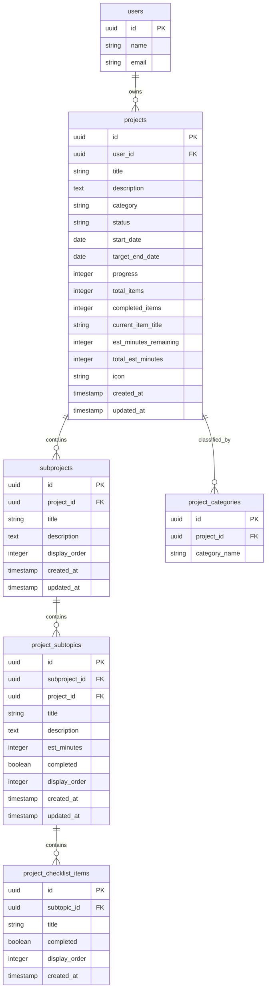

# Pulse Focus Engine — Complete Project & System API Specification Document

This document provides an exhaustive, production-grade technical specification of all **RESTful API Endpoints**, **Database Schemas**, **Mermaid ERD Diagrams**, **SQL DDL Scripts**, and **ORM Model Definitions** required to support the entire **Pulse Focus Engine** frontend application, with primary emphasis on the **Software Projects & Roadmap Module**.

---

## 📌 1. System Overview & Frontend Data Architecture

The frontend application (`tracker`) is built with Angular signals, managing state locally via `ProductivityStore`. To enable multi-device sync, cloud persistence, and high performance, the backend FastAPI server (`tracker-server`) must implement the user-scoped REST API endpoints and database schema detailed below.

### 3-Tier Hierarchy for Software Projects Engine

```
User (Account Owner)
 └── Software Project (e.g. "Pulse Focus Tracker App")
      └── Sub-Project Module (e.g. "Backend API Core")
           └── Project Subtopic Task (e.g. "JWT Auth & Session Management")
                └── Micro-Checklist Requirement (e.g. "Implement Access & Refresh token rotators")
```

### Auto-Calculated Project Metrics Engine
The backend database/service must dynamically compute or return:
* **Progress Percentage** (`progress`): `(completed_subtopics / total_subtopics) * 100`
* **Est. Remaining Time** (`estMinutesRemaining`): Sum of `estMinutes` for all uncompleted subtopics.
* **Total Est. Time** (`totalEstMinutes`): Sum of `estMinutes` across all subtopics in the project.
* **Current Active Task** (`currentItemTitle`): Title of the first pending subtopic task or micro-checklist item.
* **Completed Milestones Count**: `completedItems` vs `totalItems`.

---

## 🗄️ 2. Database Schema & Architecture — Software Projects Module

### 2.1 Entity Relationship Diagram (ERD)



---

### 2.2 Relational SQL DDL Scripts (MySQL / TiDB / PostgreSQL Compatible)

```sql
-- ========================================================
-- 1. Projects Table
-- ========================================================
CREATE TABLE IF NOT EXISTS projects (
    id VARCHAR(36) PRIMARY KEY,
    user_id VARCHAR(36) NOT NULL,
    title VARCHAR(255) NOT NULL,
    description TEXT NULL,
    category VARCHAR(100) NOT NULL DEFAULT 'Full-Stack Web App',
    status ENUM('planning', 'in_progress', 'completed', 'on_hold') NOT NULL DEFAULT 'in_progress',
    start_date DATE NULL,
    target_end_date DATE NULL,
    progress INT DEFAULT 0,
    total_items INT DEFAULT 0,
    completed_items INT DEFAULT 0,
    current_item_title VARCHAR(255) NULL,
    est_minutes_remaining INT DEFAULT 0,
    total_est_minutes INT DEFAULT 0,
    icon VARCHAR(50) DEFAULT 'Layers',
    created_at TIMESTAMP DEFAULT CURRENT_TIMESTAMP,
    updated_at TIMESTAMP DEFAULT CURRENT_TIMESTAMP ON UPDATE CURRENT_TIMESTAMP,
    FOREIGN KEY (user_id) REFERENCES users(id) ON DELETE CASCADE
);

CREATE INDEX idx_projects_user_status ON projects(user_id, status);

-- ========================================================
-- 2. Multi-Category Mapping Table
-- ========================================================
CREATE TABLE IF NOT EXISTS project_categories (
    id VARCHAR(36) PRIMARY KEY,
    project_id VARCHAR(36) NOT NULL,
    category_name VARCHAR(100) NOT NULL,
    FOREIGN KEY (project_id) REFERENCES projects(id) ON DELETE CASCADE
);

CREATE INDEX idx_proj_categories ON project_categories(project_id);

-- ========================================================
-- 3. Sub-Projects (Modules) Table
-- ========================================================
CREATE TABLE IF NOT EXISTS subprojects (
    id VARCHAR(36) PRIMARY KEY,
    project_id VARCHAR(36) NOT NULL,
    title VARCHAR(255) NOT NULL,
    description TEXT NULL,
    display_order INT DEFAULT 0,
    created_at TIMESTAMP DEFAULT CURRENT_TIMESTAMP,
    updated_at TIMESTAMP DEFAULT CURRENT_TIMESTAMP ON UPDATE CURRENT_TIMESTAMP,
    FOREIGN KEY (project_id) REFERENCES projects(id) ON DELETE CASCADE
);

CREATE INDEX idx_subprojects_proj_id ON subprojects(project_id);

-- ========================================================
-- 4. Project Subtopic Tasks (Milestones) Table
-- ========================================================
CREATE TABLE IF NOT EXISTS project_subtopics (
    id VARCHAR(36) PRIMARY KEY,
    subproject_id VARCHAR(36) NOT NULL,
    project_id VARCHAR(36) NOT NULL,
    title VARCHAR(255) NOT NULL,
    description TEXT NULL,
    est_minutes INT DEFAULT 30,
    completed BOOLEAN DEFAULT FALSE,
    display_order INT DEFAULT 0,
    created_at TIMESTAMP DEFAULT CURRENT_TIMESTAMP,
    updated_at TIMESTAMP DEFAULT CURRENT_TIMESTAMP ON UPDATE CURRENT_TIMESTAMP,
    FOREIGN KEY (subproject_id) REFERENCES subprojects(id) ON DELETE CASCADE,
    FOREIGN KEY (project_id) REFERENCES projects(id) ON DELETE CASCADE
);

CREATE INDEX idx_psubtopics_subproject ON project_subtopics(subproject_id);
CREATE INDEX idx_psubtopics_project ON project_subtopics(project_id);

-- ========================================================
-- 5. Subtopic Micro-Checklist Items Table
-- ========================================================
CREATE TABLE IF NOT EXISTS project_checklist_items (
    id VARCHAR(36) PRIMARY KEY,
    subtopic_id VARCHAR(36) NOT NULL,
    title VARCHAR(255) NOT NULL,
    completed BOOLEAN DEFAULT FALSE,
    display_order INT DEFAULT 0,
    created_at TIMESTAMP DEFAULT CURRENT_TIMESTAMP,
    FOREIGN KEY (subtopic_id) REFERENCES project_subtopics(id) ON DELETE CASCADE
);

CREATE INDEX idx_pchecklist_subtopic ON project_checklist_items(subtopic_id);
```

---

### 2.3 Python SQLAlchemy ORM Definitions (`tracker-server` Ready)

```python
import uuid
from datetime import datetime, timezone
from sqlalchemy import Boolean, Column, Date, DateTime, Enum, ForeignKey, Integer, String, Text
from sqlalchemy.orm import relationship
from app.config.database import Base

def generate_uuid() -> str:
    return str(uuid.uuid4())

def utc_now() -> datetime:
    return datetime.now(timezone.utc)

class Project(Base):
    __tablename__ = "projects"

    id = Column(String(36), primary_key=True, default=generate_uuid)
    user_id = Column(String(36), ForeignKey("users.id", ondelete="CASCADE"), nullable=False, index=True)
    title = Column(String(255), nullable=False)
    description = Column(Text, nullable=True)
    category = Column(String(100), default="Full-Stack Web App")
    status = Column(Enum("planning", "in_progress", "completed", "on_hold", name="project_status_enum"), default="in_progress")
    start_date = Column(Date, nullable=True)
    target_end_date = Column(Date, nullable=True)
    progress = Column(Integer, default=0)
    total_items = Column(Integer, default=0)
    completed_items = Column(Integer, default=0)
    current_item_title = Column(String(255), nullable=True)
    est_minutes_remaining = Column(Integer, default=0)
    total_est_minutes = Column(Integer, default=0)
    icon = Column(String(50), default="Layers")
    created_at = Column(DateTime, default=utc_now)
    updated_at = Column(DateTime, default=utc_now, onupdate=utc_now)

    # Relationships
    user = relationship("User", back_populates="projects")
    subprojects = relationship("SubProject", back_populates="project", cascade="all, delete-orphan", order_by="SubProject.display_order")
    categories = relationship("ProjectCategoryTag", back_populates="project", cascade="all, delete-orphan")


class ProjectCategoryTag(Base):
    __tablename__ = "project_categories"

    id = Column(String(36), primary_key=True, default=generate_uuid)
    project_id = Column(String(36), ForeignKey("projects.id", ondelete="CASCADE"), nullable=False, index=True)
    category_name = Column(String(100), nullable=False)

    project = relationship("Project", back_populates="categories")


class SubProject(Base):
    __tablename__ = "subprojects"

    id = Column(String(36), primary_key=True, default=generate_uuid)
    project_id = Column(String(36), ForeignKey("projects.id", ondelete="CASCADE"), nullable=False, index=True)
    title = Column(String(255), nullable=False)
    description = Column(Text, nullable=True)
    display_order = Column(Integer, default=0)
    created_at = Column(DateTime, default=utc_now)
    updated_at = Column(DateTime, default=utc_now, onupdate=utc_now)

    project = relationship("Project", back_populates="subprojects")
    subtopics = relationship("ProjectSubtopic", back_populates="subproject", cascade="all, delete-orphan", order_by="ProjectSubtopic.display_order")


class ProjectSubtopic(Base):
    __tablename__ = "project_subtopics"

    id = Column(String(36), primary_key=True, default=generate_uuid)
    subproject_id = Column(String(36), ForeignKey("subprojects.id", ondelete="CASCADE"), nullable=False, index=True)
    project_id = Column(String(36), ForeignKey("projects.id", ondelete="CASCADE"), nullable=False, index=True)
    title = Column(String(255), nullable=False)
    description = Column(Text, nullable=True)
    est_minutes = Column(Integer, default=30)
    completed = Column(Boolean, default=False)
    display_order = Column(Integer, default=0)
    created_at = Column(DateTime, default=utc_now)
    updated_at = Column(DateTime, default=utc_now, onupdate=utc_now)

    subproject = relationship("SubProject", back_populates="subtopics")
    checklist = relationship("ProjectChecklistItem", back_populates="subtopic", cascade="all, delete-orphan", order_by="ProjectChecklistItem.display_order")


class ProjectChecklistItem(Base):
    __tablename__ = "project_checklist_items"

    id = Column(String(36), primary_key=True, default=generate_uuid)
    subtopic_id = Column(String(36), ForeignKey("project_subtopics.id", ondelete="CASCADE"), nullable=False, index=True)
    title = Column(String(255), nullable=False)
    completed = Column(Boolean, default=False)
    display_order = Column(Integer, default=0)
    created_at = Column(DateTime, default=utc_now)

    subtopic = relationship("ProjectSubtopic", back_populates="checklist")
```

---

## 🌐 3. Software Projects REST API Specification

All request endpoints require `Authorization: Bearer <accessToken>`.

---

### 3.1 Get All Projects
* **HTTP Method**: `GET`
* **Path**: `/api/v1/projects`
* **Query Parameters**:
  * `category` *(optional)*: Filter by category (e.g., `Full-Stack Web App`, `AI / ML`, `Mobile App`)
  * `status` *(optional)*: Filter by status (`planning`, `in_progress`, `completed`, `on_hold`)

#### Response (`200 OK`)
```json
{
  "success": true,
  "count": 2,
  "data": [
    {
      "id": "proj-101",
      "title": "Pulse Focus Engine Web Platform",
      "description": "Enterprise Angular 19 productivity engine with FastAPI backend.",
      "category": "Full-Stack Web App",
      "categories": ["Full-Stack Web App", "AI / ML"],
      "status": "in_progress",
      "startDate": "2026-08-20",
      "targetEndDate": "2026-10-15",
      "progress": 50,
      "totalItems": 4,
      "completedItems": 2,
      "currentItemTitle": "Backend API Core > JWT Auth & Session Management",
      "estMinutesRemaining": 90,
      "totalEstMinutes": 180,
      "icon": "Layers"
    }
  ]
}
```

---

### 3.2 Create Software Project
* **HTTP Method**: `POST`
* **Path**: `/api/v1/projects`

#### Request Body
```json
{
  "title": "Autonomous AI Agent Workflow",
  "description": "Multi-agent orchestration system built with Python FastAPI and Angular.",
  "category": "AI / ML",
  "categories": ["AI / ML", "Backend Engineering"],
  "status": "planning",
  "startDate": "2026-09-01",
  "targetEndDate": "2026-11-30",
  "icon": "Cpu",
  "subprojects": [
    {
      "title": "Agent Orchestrator",
      "description": "Core LLM tool calling engine.",
      "subtopics": [
        {
          "title": "Implement ReAct Loop",
          "description": "Reasoning and tool invocation execution loop.",
          "estMinutes": 60,
          "checklist": ["Define tool schemas", "Handle multi-turn context"]
        }
      ]
    }
  ]
}
```

#### Response (`201 Created`)
```json
{
  "success": true,
  "message": "Software project created successfully.",
  "data": {
    "id": "proj-agent-01",
    "title": "Autonomous AI Agent Workflow",
    "category": "AI / ML",
    "status": "planning",
    "progress": 0,
    "totalItems": 1,
    "completedItems": 0,
    "estMinutesRemaining": 60,
    "totalEstMinutes": 60
  }
}
```

---

### 3.3 Get Detailed Single Project Content
* **HTTP Method**: `GET`
* **Path**: `/api/v1/projects/:id`
* **Description**: Returns full project metadata and 3-tier nested subprojects, subtopics, and micro-checklists.

#### Response (`200 OK`)
```json
{
  "success": true,
  "data": {
    "id": "proj-101",
    "title": "Pulse Focus Engine Web Platform",
    "description": "Enterprise Angular 19 productivity engine with FastAPI backend.",
    "category": "Full-Stack Web App",
    "categories": ["Full-Stack Web App", "AI / ML"],
    "status": "in_progress",
    "startDate": "2026-08-20",
    "targetEndDate": "2026-10-15",
    "progress": 50,
    "totalItems": 2,
    "completedItems": 1,
    "currentItemTitle": "Backend API Core > JWT Auth & Session Management",
    "estMinutesRemaining": 45,
    "totalEstMinutes": 90,
    "icon": "Layers",
    "subprojects": [
      {
        "id": "sp-1",
        "title": "Backend API Core",
        "description": "FastAPI modular backend setup.",
        "subtopics": [
          {
            "id": "psub-1",
            "title": "Database Schema Setup",
            "description": "Configure SQLAlchemy models and MySQL migration scripts.",
            "estMinutes": 45,
            "completed": true,
            "checklist": [
              { "id": "pc-1", "title": "Write SQL DDL scripts", "completed": true }
            ]
          },
          {
            "id": "psub-2",
            "title": "JWT Auth & Session Management",
            "description": "Implement OAuth2 Bearer tokens and 2FA handlers.",
            "estMinutes": 45,
            "completed": false,
            "checklist": [
              { "id": "pc-2", "title": "Implement TOTP generator", "completed": false }
            ]
          }
        ]
      }
    ]
  }
}
```

---

### 3.4 Update Project Metadata
* **HTTP Method**: `PUT`
* **Path**: `/api/v1/projects/:id`

#### Request Body
```json
{
  "title": "Pulse Focus Engine v2.0",
  "description": "Updated project description",
  "category": "Full-Stack Web App",
  "categories": ["Full-Stack Web App", "Cloud Architecture"],
  "status": "in_progress",
  "targetEndDate": "2026-12-15",
  "icon": "Zap"
}
```

#### Response (`200 OK`)
```json
{
  "success": true,
  "message": "Project updated successfully.",
  "data": {
    "id": "proj-101",
    "title": "Pulse Focus Engine v2.0",
    "status": "in_progress"
  }
}
```

---

### 3.5 Delete Software Project
* **HTTP Method**: `DELETE`
* **Path**: `/api/v1/projects/:id`

#### Response (`200 OK`)
```json
{
  "success": true,
  "message": "Project deleted successfully."
}
```

---

### 3.6 Create Sub-Project Module
* **HTTP Method**: `POST`
* **Path**: `/api/v1/projects/:id/subprojects`

#### Request Body
```json
{
  "title": "Frontend Client Module",
  "description": "Angular 19 Signals & Tailwind UI implementation."
}
```

#### Response (`201 Created`)
```json
{
  "success": true,
  "data": {
    "id": "sp-2",
    "projectId": "proj-101",
    "title": "Frontend Client Module",
    "description": "Angular 19 Signals & Tailwind UI implementation.",
    "subtopics": []
  }
}
```

---

### 3.7 Create Subtopic Task Milestone under Sub-Project
* **HTTP Method**: `POST`
* **Path**: `/api/v1/projects/:id/subprojects/:subprojectId/subtopics`

#### Request Body
```json
{
  "title": "State Management with Signals",
  "description": "Build signal store for local caching and offline storage.",
  "estMinutes": 60,
  "checklist": [
    "Create ProductivityStore signal service",
    "Integrate localStorage effect sync"
  ]
}
```

#### Response (`201 Created`)
```json
{
  "success": true,
  "data": {
    "id": "psub-109",
    "subprojectId": "sp-2",
    "projectId": "proj-101",
    "title": "State Management with Signals",
    "estMinutes": 60,
    "completed": false,
    "checklist": [
      { "id": "pc-10", "title": "Create ProductivityStore signal service", "completed": false },
      { "id": "pc-11", "title": "Integrate localStorage effect sync", "completed": false }
    ]
  }
}
```

---

### 3.8 Toggle Subtopic Task Completion
* **HTTP Method**: `PATCH`
* **Path**: `/api/v1/projects/:id/subtopics/:subtopicId/toggle`

#### Response (`200 OK`)
```json
{
  "success": true,
  "message": "Subtopic task status toggled.",
  "data": {
    "subtopicId": "psub-109",
    "completed": true,
    "projectProgress": 75,
    "estMinutesRemaining": 30
  }
}
```

---

### 3.9 Add & Toggle Micro-Checklist Task Items
* **Add Item**: `POST /api/v1/projects/:id/subtopics/:subtopicId/checklist`
* **Toggle Item**: `PATCH /api/v1/projects/:id/subtopics/:subtopicId/checklist/:itemId/toggle`
* **Delete Item**: `DELETE /api/v1/projects/:id/subtopics/:subtopicId/checklist/:itemId`

---

### 3.10 Dual-Mode Raw JSON Payload Import/Overwrite
* **HTTP Method**: `PUT`
* **Path**: `/api/v1/projects/:id/raw-json`

#### Request Body
```json
{
  "jsonPayload": "{\n  \"title\": \"Pulse Focus Engine Web Platform\",\n  \"category\": \"Full-Stack Web App\",\n  \"status\": \"in_progress\",\n  \"subprojects\": [\n    {\n      \"title\": \"Core Engine\",\n      \"subtopics\": [\n        {\n          \"title\": \"Task Execution\",\n          \"estMinutes\": 30,\n          \"completed\": false,\n          \"checklist\": [\"Verify API specs\"]\n        }\n      ]\n    }\n  ]\n}"
}
```

---

## 📋 4. Complete System API Blueprint (All Other Frontend Modules)

Below is the complete inventory of API routes required across the entire frontend application:

| Module | Method | Endpoint | Description |
| :--- | :--- | :--- | :--- |
| **Auth** | `POST` | `/api/v1/auth/register` | Register new user account |
| **Auth** | `POST` | `/api/v1/auth/verify-otp` | Verify email OTP code |
| **Auth** | `POST` | `/api/v1/auth/resend-otp` | Resend email verification code |
| **Auth** | `POST` | `/api/v1/auth/login` | Authenticate user & return JWT tokens |
| **Auth** | `POST` | `/api/v1/auth/refresh-token` | Obtain new access token |
| **Auth** | `POST` | `/api/v1/auth/forgot-password` | Send password reset email |
| **Auth** | `POST` | `/api/v1/auth/reset-password` | Reset password using OTP code |
| **User Profile** | `GET` | `/api/v1/user/profile` | Retrieve profile information |
| **User Profile** | `PUT` | `/api/v1/user/profile` | Update profile information |
| **User Profile** | `POST` | `/api/v1/user/avatar` | Upload profile avatar |
| **User Profile** | `PUT` | `/api/v1/user/change-password` | Change user password |
| **User Profile** | `GET` | `/api/v1/user/sessions` | List active device sessions |
| **User Profile** | `POST` | `/api/v1/user/2fa/enable` | Initiate 2FA TOTP setup |
| **Learning** | `GET` | `/api/v1/learning/roadmaps` | List user learning roadmaps |
| **Learning** | `POST` | `/api/v1/learning/roadmaps` | Create learning roadmap |
| **Learning** | `GET` | `/api/v1/learning/roadmaps/:id` | Get roadmap detail with subtopics |
| **Schedule** | `GET` | `/api/v1/schedule/events` | List user calendar events |
| **Schedule** | `POST` | `/api/v1/schedule/events` | Create schedule event |
| **Reminders** | `GET` | `/api/v1/reminders` | List user reminders |
| **Reminders** | `POST` | `/api/v1/reminders` | Create reminder (voice note supported) |
| **Finance** | `GET` | `/api/v1/finance/goals` | List financial savings goals |
| **Finance** | `POST` | `/api/v1/finance/goals` | Create financial goal |
| **Finance** | `GET` | `/api/v1/finance/expenses` | List expense records |
| **Finance** | `POST` | `/api/v1/finance/expenses` | Log expense item |
| **Analytics** | `GET` | `/api/v1/analytics/dashboard` | Aggregated dashboard activity metrics |

---

## 🛠️ 5. Implementation Roadmap for Backend Developer

1. **Database Setup**: Execute the DDL SQL scripts or run SQLAlchemy model creation (`init_db()`) to create `projects`, `subprojects`, `project_subtopics`, and `project_checklist_items` tables.
2. **Schema Validation**: Define Pydantic request/response models in `tracker-server/app/schemas/project_schemas.py`.
3. **Service Layer**: Build business logic calculations (`calculate_project_stats`) in `tracker-server/app/services/project_service.py`.
4. **Router Registration**: Expose endpoints in `tracker-server/app/routes/projects.py` and register the router in `app/main.py`.
